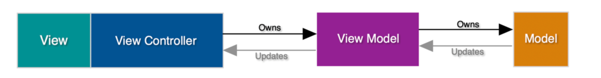

# MVVM (Model-View-ViewModel) Pattern in React

- [What](#what)
  - [MVVM Architectural Pattern](#enterprise-architecture-pattern)
  - [MVVM vs. MVC](#mvvm-vs-mvc)
  - [References](#references)
- [How](#how)
  - [Pattern](#pattern)
    - [Separating business logic from the view](#separating-business-logic-from-the-view)
    - [Naming conventions and folder structure](#naming-conventions-and-folder-structure)
    - [ViewController vs. ViewModel](#viewcontroller-vs-viewmodel)
    - [Summary](#summary)
  - [Incremental Adoption](#incremental-adoption)
    - [Factor out to view model hooks](#factor-out-to-view-model-hooks)
    - [Factor out to shared domain model hooks](#factor-out-to-shared-domain-model-hooks)
  - [Other Considerations](#other-considerations)
    - [Sharing view models](#sharing-view-models)
- [Why](#why)
  - [Testability](#testability)
  - [Maintainability](#maintainability)
  - [Scalability](#scalability)
  - [Collaboration](#collaboration)
- [Tradeoffs](#tradeoffs)

# What

This document covers the following:

- The MVVM architectural pattern
- A proposed implementation of the pattern in the context of TypeScript and React
- A proposed approach for incrementally adopting the pattern in our codebase

It does not cover:

- Using signals and plain classes for further de-coupling of business logic and React (future document/proposal)

## MVVM Architectural Pattern

Model–view–viewmodel (MVVM) is an architectural pattern that facilitates the separation of the development of a user interface (the view) from the development of the business logic (the model) such that the view is not dependent upon any specific model platform.

### Components of MVVM

**Model:**

Refers to the domain model and represents the business domain being modeled, containing things like business logic, rules, repositories, services, etc. Same as the "Model" in "Model-View-Controller".

**View:**

Represents the structure, layout, and appearance of what a user sees on the screen. Displays a representation of the domain model and receives the user's interaction with the view, which is forwarded to the domain model through the view controller. Same as the "View" in "Model-View-Controller".

**View model:**

The view model is an abstraction of the view exposing public properties and commands. This view model is consumed by the view, where it can display the properties and call the commands. The view model has no reference to the view, but the view model is owned by and referenced by the view.

## MVVM vs. MVC

The biggest difference between MVVM and MVC is that MVVM introduces a layer between the view controller (or view) and the model. This enables you to further decouple the development of the business logic and the user interface.

The same feature in both an MVC and an MVVM application could be structured in the following way:

### MVC


View:

- Displays properties passed to it
- Triggers commands passed to it on user interaction

Controller:

- Has a reference to the view
- Is responsible for rendering the view
- Has references to one or more models
- Is responsible for mapping properties and commands from those models into something that can be passed to and consumed by the view

Model:

- Contains the domain/business logic
- Exposes properties and commands that can be consumed

#### Code Example

```tsx
/**
 * Domain types
 */
type Status = 'TODO' | 'IN_PROGRESS' : 'DONE';

type Task = {
  id: string;
  text: string;
  status: STATUS;
}

/**
 * Models
 */
const useTasksModel = (): {
  tasks: Task[];
  addTask: (text: string) => void;
  isLoading: boolean;
} => {
  // ...
}

const useStatusFilterModel = (): {
  statusFilter: Status;
  setStatusFilter: (status: Status) => void
} => {
  // ...
}

/**
 * Controller
 */
const TasksController = () => {
  const {
    tasks,
    addTask,
    isLoading,
  } = useTasksModel();

  const {
    statusFilter,
  } = useStatusFilterModel();

  const [taskText, setTaskText] = useState('');

  const handleChangeTaskText = (event) => {
    setTaskText(event.target.value);
  }

  const handleSubmitTask = () => {
    addTask(taskText);
    setTaskText('');
  }

  const filteredTasks = tasks.filter((task) => task.status === statusFilter);

  return (
    <TasksView
      tasks={filteredTasks}
      isLoading={isLoading}
      onChangeTaskText={handleChangeTaskText}
      onSubmitTask={handleSubmitTask}
      taskText={taskText}
    />
  );
}

/**
 * View
 */
const TasksView = ({
  tasks,
  isLoading,
  onChangeTaskText,
  onSubmitTask,
  taskText
}) => {
  if (isLoading) {
    return <div>Loading...</div>;
  }

  const taskItems = tasks.map((task) => <TaskItem key={task.id} task={task} />);

  return (
    <div>
      <h1>Tasks</h1>
      <ul>{taskItems}</ul>
      <input type="text" value={taskText} onChange={onChangeTaskText} />
      <button type="submit" onClick={onSubmitTask}>
    </div>
  );
}
```

### MVVM



View:

- Displays properties passed to it
- Triggers commands passed to it on user interaction

Controller:

- Has a reference to the view
- Is responsible for rendering the view
- _\*Has a reference to the view model_
- _\*Is responsible for forwarding the view model properties and commands into the view_

View model:

- Has references to one or more models
- Is responsible for mapping properties and commands from those models into something consumable by the view controller

Model:

- Contains the domain/business logic
- Exposes properties and commands that can be consumed

#### Code Example

```tsx
/**
 * Domain types
 */
type Status = 'TODO' | 'IN_PROGRESS' : 'DONE';

type Task = {
  id: string;
  text: string;
  status: STATUS;
}

/**
 * Models
 */
const useTasksModel = (): {
  tasks: Task[];
  addTask: (text: string) => void;
  isLoading: boolean;
} => {
  // ...
}

const useStatusFilterModel = (): {
  statusFilter: Status;
  setStatusFilter: (status: Status) => void
} => {
  // ...
}

/**
 * View Model
 */
const useTasksViewModel = () => {
  /**
   * Pull in what we need from domain models
   */
  const {
    tasks,
    addTask,
    isLoading,
  } = useTasksModel();

  const {
    statusFilter,
  } = useStatusFilterModel();

  /**
   * Do any processing, combining, mapping, filtering,
   * etc. necessary to make the domain data directly
   * consumable by the view
   */
  const filteredTasks = tasks.filter((task) => task.status === statusFilter);

  /**
   * TODO(eiriklv): Add separate commands instead of mapping directly from the domain models,
   * and show that this is where you would do validation, etc.
   *
   * The main point is to make the domains as easy as possible to use for
   * the consuming view and that it should be insulated from changes in the domain
   * by terminating it in the view model, not the view itself.
   */

  return {
    tasks: filteredTasks,
    addTask,
    isLoading,
  }
}

/**
 * Controller
 */
const TasksController = () => {
  const {
    tasks,
    addTask,
    isLoading,
  } = useTasksViewModel();

  const [taskText, setTaskText] = useState('');

  const handleChangeTaskText = (event) => {
    setTaskText(event.target.value);
  }

  const handleSubmitTask = () => {
    addTask(taskText);
    setTaskText('');
  }

  return (
    <TasksView
      tasks={tasks}
      isLoading={isLoading}
      onChangeTaskText={handleChangeTaskText}
      onSubmitTask={handleSubmitTask}
      taskText={taskText}
    />
  );
}

/**
 * View
 */
const TasksView = ({
  tasks,
  isLoading,
  onChangeTaskText,
  onSubmitTask,
  taskText
}) => {
  if (isLoading) {
    return <div>Loading...</div>;
  }

  const taskItems = tasks.map((task) => <TaskItem key={task.id} task={task} />);

  return (
    <div>
      <h1>Tasks</h1>
      <ul>{taskItems}</ul>
      <input type="text" value={taskText} onChange={onChangeTaskText} />
      <button type="submit" onClick={onSubmitTask}>
    </div>
  );
}
```

## References

- https://en.wikipedia.org/wiki/Model%E2%80%93view%E2%80%93viewmodel
- https://learn.microsoft.com/en-us/dotnet/architecture/maui/mvvm
- https://learn.microsoft.com/en-us/archive/msdn-magazine/2009/february/patterns-wpf-apps-with-the-model-view-viewmodel-design-pattern
- https://learn.microsoft.com/en-us/previous-versions/xamarin/xamarin-forms/enterprise-application-patterns/mvvm

# How

## Pattern

### Separating business logic from the view

TODO: Show a stepwise process of going from non-MVC to MVC to MVVM
TODO: Add reference to the "Separation of concerns tech talk video" + repository

### ViewController vs. ViewModel

TODO: Show and explain the important distinctions between the view controller and the view model

### Naming conventions and folder structure

TODO: Show and explain naming conventions and file structure we want to use in the Fusion codebase

### Summary

**Folder structure**

```
/features
  /tasks
    /types
      types.ts
    /models
      tasks.model.ts
      status-filter.model.ts
    /views
      tasks.view-model.ts
      tasks.view.tsx
```

**Files**

`types.ts`:

```ts
/**
 * Domain types
 */
export type Status = 'TODO' | 'IN_PROGRESS' : 'DONE';

export type Task = {
  id: string;
  text: string;
  status: STATUS;
}
```

`tasks.model.ts`:

```ts
import type { Task } from "../types/types";

/**
 * Domain model
 */
export const useTasksModel = (): {
  tasks: Task[];
  addTask: (text: string) => void;
  isLoading: boolean;
} => {
  // ...
};
```

`status-filter.model.ts`:

```ts
import type { Status } from "../types/types";

/**
 * Domain model
 */
const useStatusFilterModel = (): {
  statusFilter: Status;
  setStatusFilter: (status: Status) => void;
} => {
  // ...
};
```

`tasks.view-model.ts`:

```ts
import { useTasksModel } from "../models/tasks.model";
import { useStatusFilterModel } from "../models/status-filter.model";

/**
 * View Model
 */
const useTasksViewModel = () => {
  /**
   * Pull in what we need from domain models
   *
   * NOTE: As there is only one view model per view,
   * any domain specific data or command must be
   * provided through the view model hook.
   *
   * No other domain/business related hooks should
   * ever be necessary to include in the view
   */
  const { tasks, addTask, isLoading } = useTasksModel();

  const { statusFilter } = useStatusFilterModel();

  /**
   * Do any processing, combining, mapping, filtering,
   * etc. necessary to make the domain data directly
   * consumable by the view
   */
  const filteredTasks = tasks.filter((task) => task.status === statusFilter);

  /**
   * Create commands to expose to the view,
   * where we can do validation and error handling
   */
  const addTaskCommand = (text?: string) => {
    /**
     * Validation
     */
    if (!text) {
      return;
    }

    addTask(text);
  };

  /**
   * The main point is to make the domains as easy as possible to use for
   * the consuming view and that it should be insulated from changes in the domain
   * by terminating it in the view model, not the view itself.
   */
  return {
    tasks: filteredTasks,
    addTask: addTaskCommand,
    isLoading,
  };
};
```

`tasks.view.tsx`

```tsx
/**
 * Controller/View
 */
const TasksView = () => {
  /**
   * Pull out what we need from the view model
   */
  const {
    tasks,
    addTask,
    isLoading,
  } = useTasksViewModel();

  /**
   * View specific state
   */
  const [taskText, setTaskText] = useState('');

  /**
   * View specific handlers
   */
  const handleChangeTaskText = (event) => {
    setTaskText(event.target.value);
  }

  const handleSubmitTask = () => {
    addTask(taskText);
    setTaskText('');
  }

  /**
   * View logic
   */
  if (isLoading) {
    return <div>Loading...</div>;
  }

  const taskItems = tasks.map((task) => <TaskItem key={task.id} task={task} />);

  return (
    <div>
      <h1>Tasks</h1>
      <ul>{taskItems}</ul>
      <input type="text" value={taskText} onChange={handleChangeTaskText} />
      <button type="submit" onClick={handleSubmitTask}>
    </div>
  );
}
```

## Incremental Adoption

TODO

- Show how you can incrementally adopt this in an existing codebase
- Use some relatable example as a starting point
  - "Separation of concerns tech talk" + repository

Code Example:

```ts
// TODO
```

### Factor out to view model hooks

TODO

Code Example:

```ts
// TODO
```

### Factor out to shared domain model hooks

TODO

Code Example:

```ts
// TODO
```

# Why

The main reason for introducing a pattern like MVVM is to enable better separation of concerns, making it possible to work much more independently in each layer of the application. By only having to agree on the interfaces between the layers it means that it to a much larger degree than before is possible to develop the layers separately and in parallel. This is mainly achieved by the view model, which acts as a mapping layer between the view layer and the business logic layer.

## Testability

Every layer can be tested separately (model, view, view model)

- Test the view independently of the business logic layer, only having to care about the interface of the view model
  - Simpler tests, because of less concerns
  - Tests are unaffected by changes in the view model layer and below, as long as the interface of the view model stays the same
- Test the view model independent of the view
  - Test the view logic without the actual view
- Test business logic independently of the view layer (view/view controller/view model)
  - Simpler tests, because of less concerns
  - Tests are unaffected by changes to the view layer, as it has no knowledge of it

Advantages:

- Opportunity for less brittle tests that break only for useful reasons

Code Examples:

```ts
// TODO (examples for testing each layer; view, view model, model)
```

## Maintainability

Because of the clear separation of the layers and the introduction of interfaces between them it should ideally increase the maintainability of the application. Each part can be approached separately, both in terms of application code and tests. Each layer can be changed/replaced independently without affecting the other layers. Only interface changes needs coordination between the layers.

Examples:

- Changing the view (how things are displayed and interacted with)
  - No changes to the view model and below, only the view/view controller
- Changing the business logic (how things work underneath)
  - Changes in the model layer
  - Changes in the view model layer
- Changes that require interface changes
  - New requirement in UX that triggers an interface change in the view model, which then propagates down to the model layer

Code Examples:

```ts
// TODO (one example for each)
```

## Scalability

Because of the clear separation of concerns when using MVVM it means that your business logic complexity does not affect your view logic complexity, and vice versa, ensuring better scalability of the application.

Example:

- Adding another view on top of existing business logic
  - New view with new view model interface
  - New view model with new implementation (different mappings of existing business logic)

Code Examples:

```ts
// TODO (one example for each)
```

## Collaboration

Since MVVM creates a much clearer separation between the view layer and business logic layer it increases the possibility to work in parallel. Agreeing on the interface returned by the view models is sufficient for working on both the view and the business logic in parallel. The views can be tested with mocked out view models following the interface, while the view model and business logic underneath can be tested separately according to agreed upon interface/contract.

Code Example:

```ts
// TODO
```

# Tradeoffs

TODO
